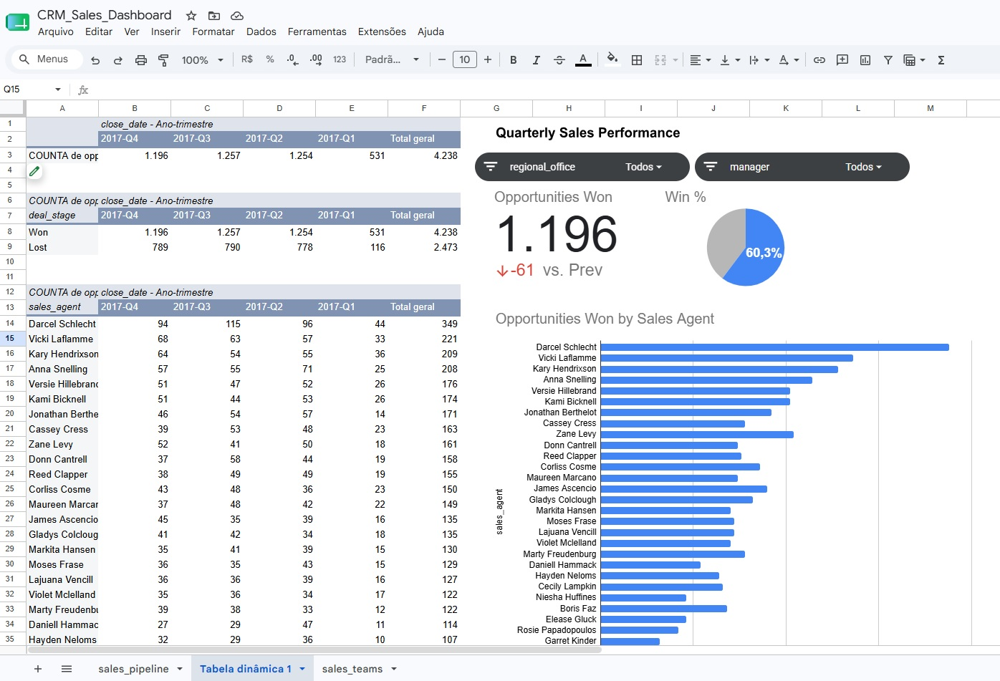

# CRM Sales Dashboard — Google Sheets

A dynamic CRM and sales performance dashboard built in **Google Sheets** using the Maven Analytics sales pipeline dataset. The project transforms raw opportunity data into an interactive reporting experience for monitoring pipeline outcomes, quarterly trends, and sales-agent performance.

## 📊 Dashboard Preview

> The dashboard includes KPI scorecards, quarterly performance analysis, win/loss distribution, sales-agent rankings, and interactive filters.

## 🔗 Live Dashboard

[**Open the live CRM dashboard in Google Sheets →**](https://docs.google.com/spreadsheets/d/148SLImRvdIjrBIzUM_VLuuZS-PvLJ_ZDuJYlYlzAGcI/edit?usp=sharing)

## 🎯 Project Objectives

- Prepare and validate the sales pipeline data.
- Enrich opportunity records with sales-manager and regional-office information.
- Analyze quarterly sales performance and conversion outcomes.
- Compare sales-agent performance using clear, decision-ready visuals.
- Build an interactive dashboard that supports filtering and exploration.

## ✨ Key Dashboard Features

### KPI Scorecards
Compares opportunities won in the most recent quarter, **2017 Q4**, with the previous quarter, **2017 Q3**, to highlight performance movement.

### Quarterly Trend Analysis
Tracks opportunities won by quarter and presents the data in a stakeholder-friendly chronological layout.

### Win/Loss Analysis
Displays the percentage split between won and lost opportunities for the latest quarter using a focused pie-chart visualization.

### Sales-Agent Leaderboard
Ranks sales agents by opportunities won during 2017 Q4, making high-performing contributors easy to identify.

### Interactive Slicers
Enables dynamic filtering by:

- Regional Office
- Manager

## 🛠️ Data Preparation & Analysis

1. **Data exploration and quality assurance** — Reviewed the sales pipeline data, checked values and time periods, and identified the products and opportunity outcomes included in the analysis.
2. **Data enrichment** — Joined sales-team information to opportunity records using `XLOOKUP` / `VLOOKUP` to map each agent to the appropriate manager and regional office.
3. **Pivot-table analysis** — Created summaries for quarterly wins, win/loss conversion rates, and sales-agent performance.
4. **Dashboard design** — Combined scorecards, charts, pivot tables, slicers, and formatting into a concise reporting interface.

## 🧰 Tools & Techniques

| Category | Details |
| --- | --- |
| Platform | Google Sheets |
| Formulas | `XLOOKUP`, `VLOOKUP`, `IF`, `IFS`, `SUMIFS`, `COUNTIFS` |
| Analysis | Pivot tables, sorting, filtering, quarterly trend analysis |
| Visualizations | KPI scorecards, bar charts, pie charts |
| Interactivity | Dashboard slicers for manager and regional-office filtering |

## 📁 Repository Contents

| File | Description |
| --- | --- |
| [`dashboard.png`](dashboard.png) | Preview image of the completed dashboard |
| [`README.md`](README.md) | Project documentation and dashboard overview |

## 🚀 How to Use

1. Open the [live Google Sheets dashboard](https://docs.google.com/spreadsheets/d/148SLImRvdIjrBIzUM_VLuuZS-PvLJ_ZDuJYlYlzAGcI/edit?usp=sharing).
2. Use the slicers to filter results by regional office or manager.
3. Review the KPI scorecards for quarterly movement.
4. Explore the charts and pivot tables to compare outcomes and agent performance.

## 📌 Project Context

This project was developed as part of the **Maven Analytics sales challenge** and demonstrates practical spreadsheet-based skills in data preparation, lookup-based data modeling, business analysis, dashboard design, and data storytelling.
